# RGIP 实验进展汇报（2026-07-08）

汇报日期：2026-07-08  
整理目录：`assets/rgip_progress_report_20260708`  
主要已完成实验：`outputs-rgip/attnfix-fullrun-20260706-030113/full-rd-tuned-attnfix-ddpfix-resume-task2-reboot-20260706-2137`

## 1. 当前已完成实验结论

本次正式可用结果来自 HICO-DET random 四阶段类增量实验，主方法为 **RGIP full / full-rd-tuned / ResNet-50 / seed140**。它已经完成 Task1--Task4，并保存了完整 checkpoint、日志、metrics 与 analysis 文件。

| 方法 | Task1 mAP | Task2 mAP | Task3 mAP | Task4 mAP | Task4 Rare | Task4 Non-Rare |
| --- | --- | --- | --- | --- | --- | --- |
| Replay-distill (ResNet, seed140) | 0.3698 | 0.3437 | 0.3231 | 0.3169 | 0.2721 | 0.3303 |
| RGIP full (ResNet, seed140) | 0.3712 | 0.3413 | 0.3300 | 0.3262 | 0.2794 | 0.3402 |
| Early RGIP full (ResNet, seed140) | 0.3695 | 0.3386 | 0.3174 | 0.3099 | 0.2649 | 0.3234 |

与 replay-distill seed140 的逐阶段差值如下：

| 阶段 | ΔmAP | ΔRare | ΔNon-Rare |
| --- | --- | --- | --- |
| Task1 | 0.0014 | 0.0033 | 0.0008 |
| Task2 | -0.0025 | -0.0170 | 0.0024 |
| Task3 | 0.0069 | 0.0256 | 0.0011 |
| Task4 | 0.0093 | 0.0073 | 0.0099 |

核心结论：RGIP full 在最终 Task4 上达到 **0.3262 mAP**，高于 replay-distill 的 **0.3169 mAP**，最终提升约 **+0.0093 mAP**；Rare 与 Non-Rare 在最终阶段均为正提升。

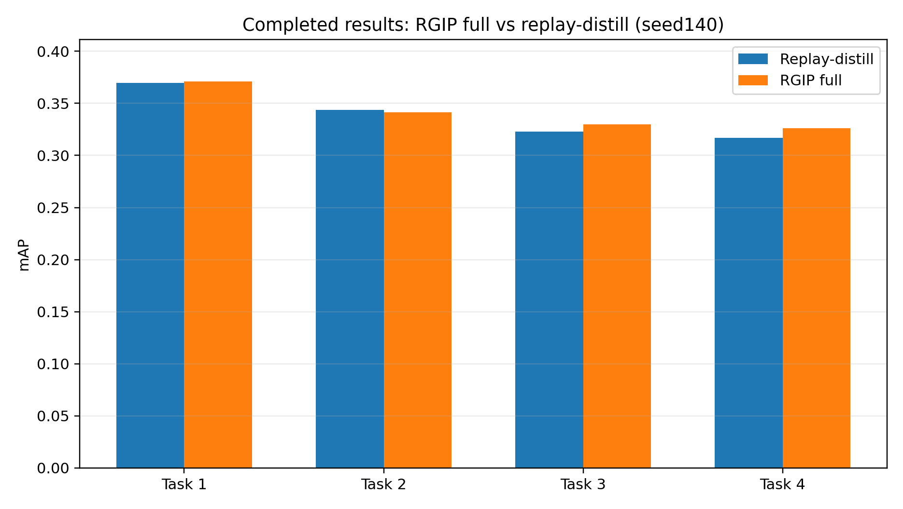

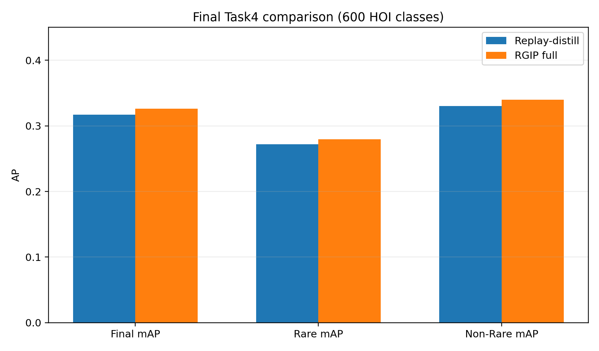

## 2. 实验设置

| 项目 | 设置 |
| --- | --- |
| 数据集 | HICO-DET |
| 协议 | 4-stage incremental，150 / 300 / 450 / 600 已见 HOI 类 |
| split mode | random |
| split seed / train seed | 140 / 140 |
| 主方法 | RGIP full-rd-tuned |
| backbone | ResNet-50 |
| detector | DETR base |
| replay per class | 50 |
| epochs per task | 30 |
| 预训练模型 | `checkpoints/detr-r50-hicodet.pth` |
| 结果路径 | `outputs-rgip/attnfix-fullrun-20260706-030113/full-rd-tuned-attnfix-ddpfix-resume-task2-reboot-20260706-2137` |

## 3. 可视化一：阶段性能

含义：展示每个增量阶段结束后在已见类别集合上的 mAP、Rare mAP、Non-Rare mAP。

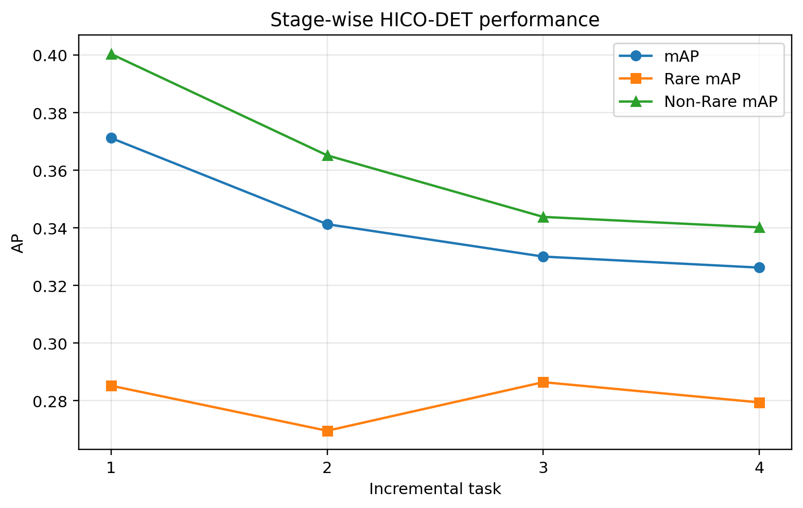

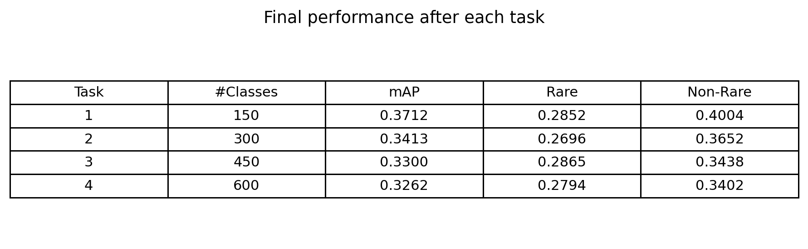

## 4. 可视化二：epoch 训练曲线

含义：展示各 task 内 epoch 级验证 mAP 变化，辅助判断收敛和是否有后期回落。

| Task | best epoch | best mAP | best Rare | best Non-Rare | final epoch | final mAP |
| --- | --- | --- | --- | --- | --- | --- |
| 2 | 26 | 0.3429 | 0.2706 | 0.3671 | 30 | 0.3413 |
| 3 | 22 | 0.3309 | 0.2810 | 0.3467 | 30 | 0.3300 |
| 4 | 24 | 0.3282 | 0.2829 | 0.3417 | 30 | 0.3262 |

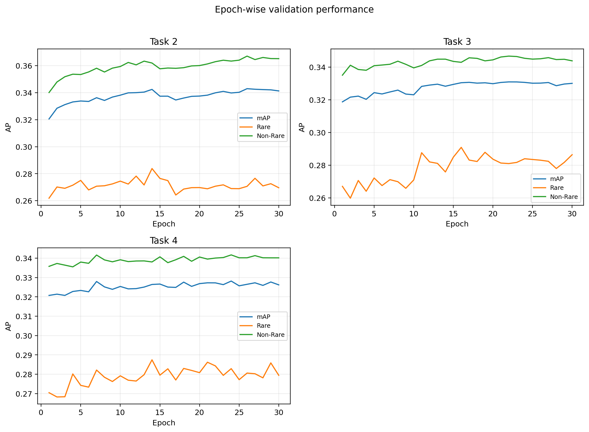

## 5. 可视化三：类别 AP 热力图

含义：展示不同评估阶段下各 HOI 类别 AP，并按类别引入阶段观察旧类保持和新类学习。

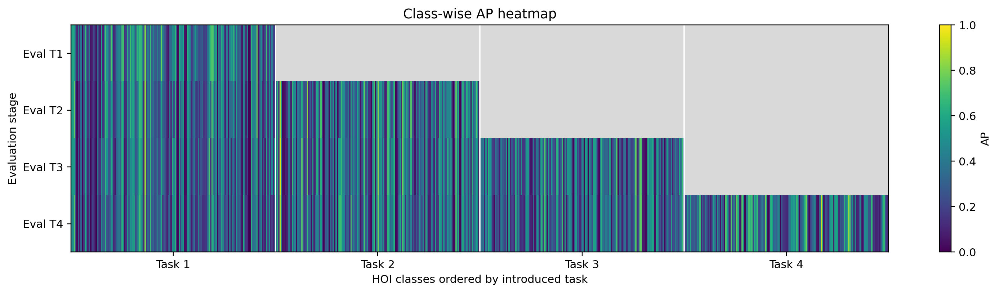

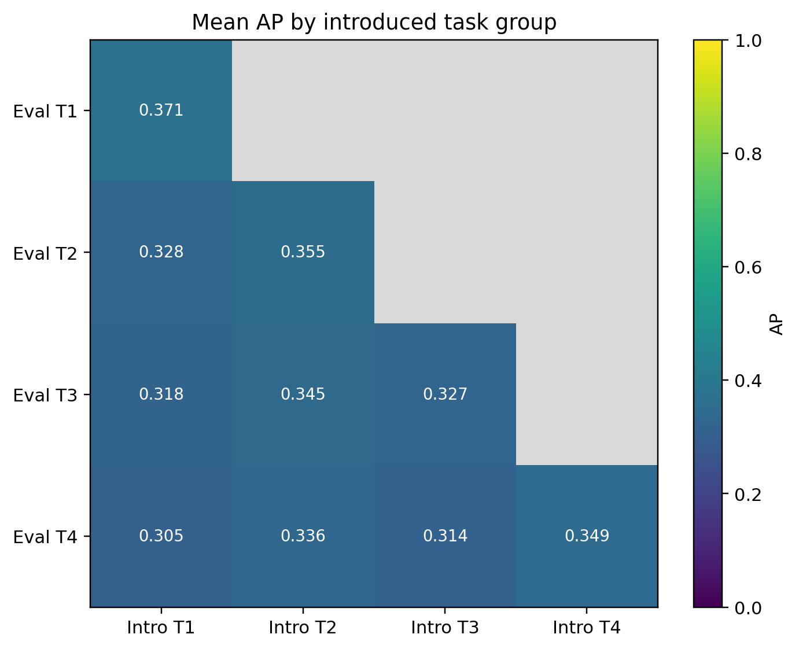

## 6. 可视化四：遗忘分析

含义：以类别引入阶段 AP 作为初始值，以最终 Task4 AP 作为最终值，统计 AP drop。

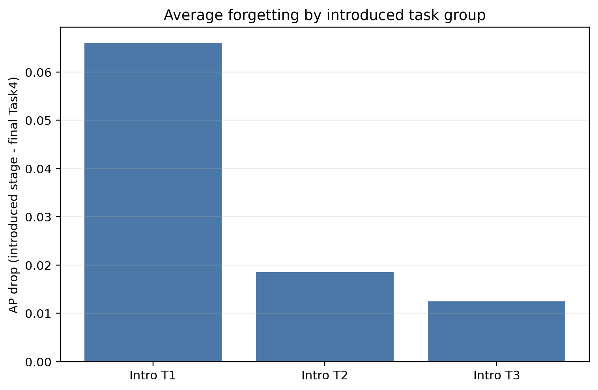

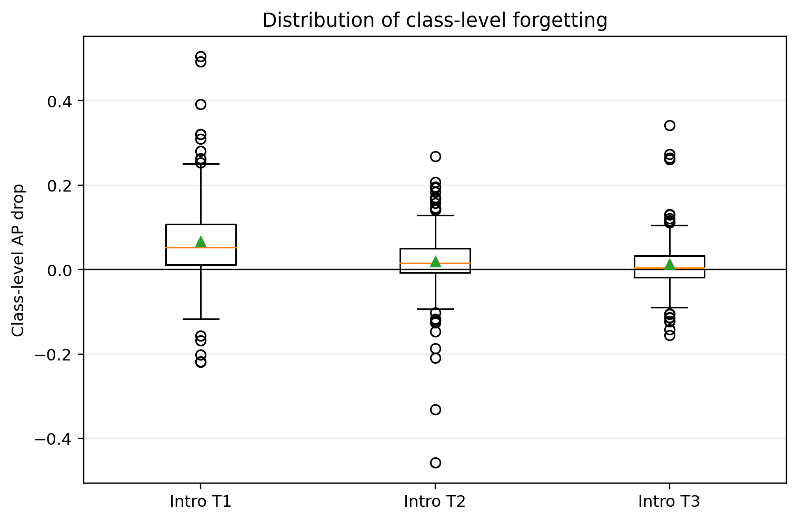

## 7. 可视化五：RGIP 损失分量

含义：展示 interaction preservation 相关损失，包括 `int_loss`、feature KD、logit KD 和 hard negative 等内部信号。

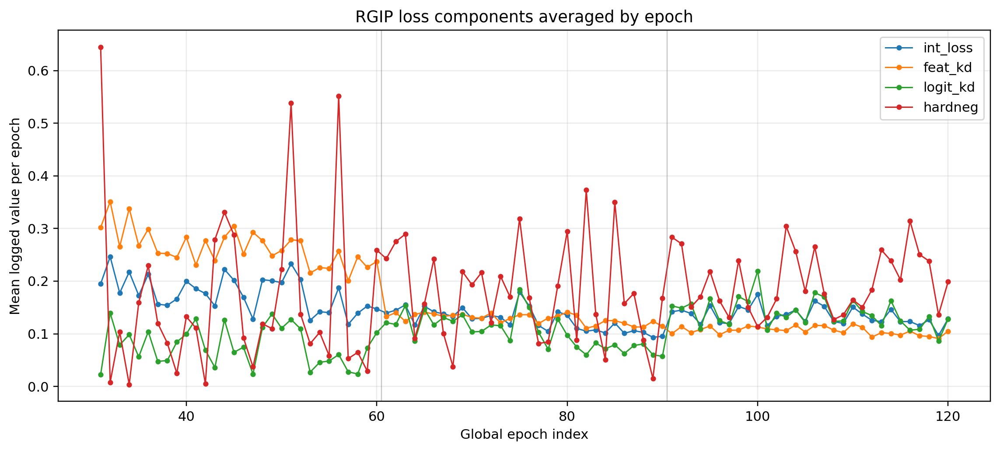

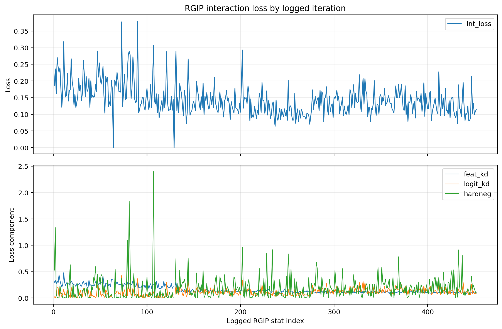

内部统计摘要：

| 指标 | count | mean | min | max | last | nonzero ratio |
| --- | --- | --- | --- | --- | --- | --- |
| rgip/int_loss | 457 | 0.1436 | 0.0000 | 0.3796 | 0.1139 | 0.9934 |
| rgip/context_modulate_pairs | 456 | 16.1820 | 0 | 105 | 26 | 0.9956 |
| rgip/modulated_pair_count | 457 | 15.6346 | 0 | 71 | 26 | 0.9934 |
| rgip/num_replay_images | 456 | 7.3443 | 1 | 16 | 13 | 1.0000 |
| rgip/prototype_count | 457 | 147.5317 | 102 | 150 | 150 | 1.0000 |
| rgip/pair_weight_max | 456 | 1.1017 | 1.0000 | 1.2382 | 1.0815 | 1.0000 |
| rgip/sis_mean | 456 | 0.0141 | 0.0000 | 0.1006 | 0.0135 | 0.9956 |
| distill/replay_loss | 457 | 0.1492 | 0.0426 | 0.5083 | 0.0731 | 1.0000 |

观察：`rgip/int_loss` 非零比例约 99%，`context_modulate_pairs` 与 `modulated_pair_count` 也几乎持续非零，说明当前正式结果中 RGIP 分支已经实际参与训练。

## 8. 可视化六：SIS 与 pair weight

含义：展示稀缺性/干扰评分与样本对权重变化。

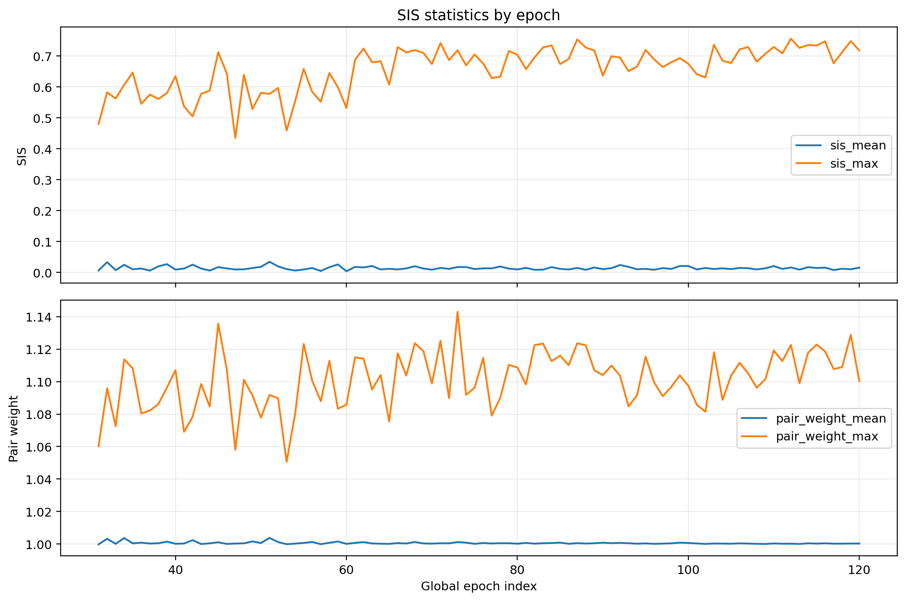

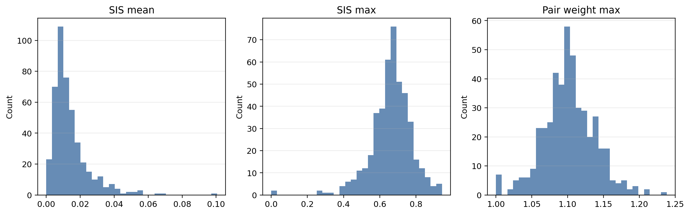

## 9. 可视化七：replay、distillation 与 prototype

含义：展示 replay 图像、蒸馏 pair、prototype bank 覆盖情况。

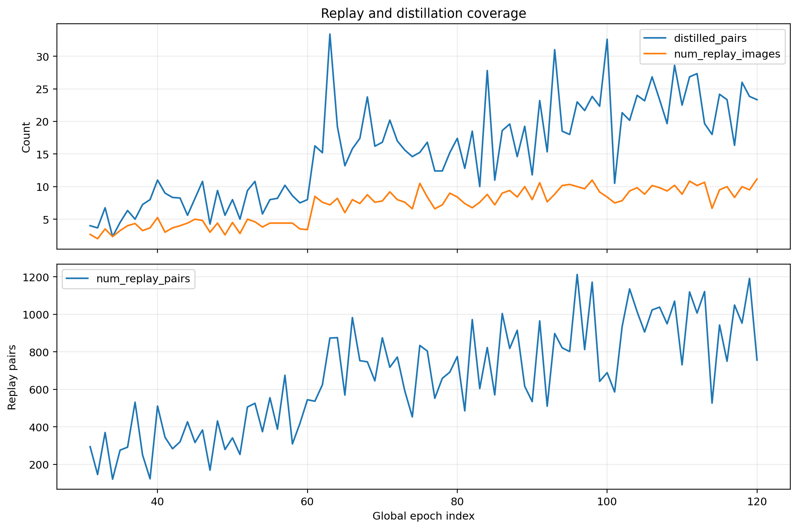

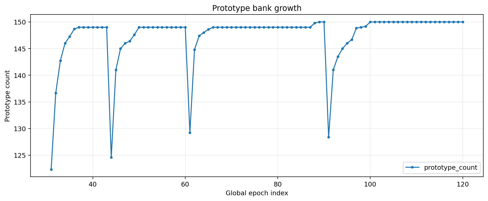

## 10. 可视化八：per-sample score 分布

含义：展示每个评估阶段保存的 GT 类 score 分布，用于辅助分析样本级置信度变化。

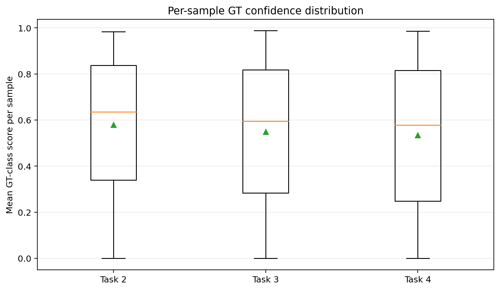

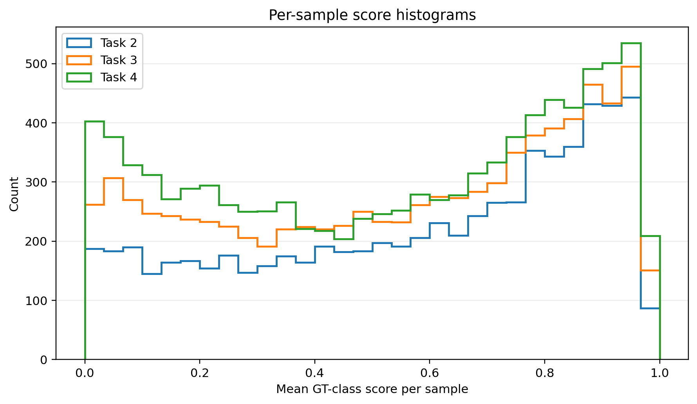

## 11. 正在运行和待完成实验

| 实验 | 位置 | 状态 | 用途 |
| --- | --- | --- | --- |
| RGIP full ResNet seed141 | 第二台 GPU1,2,3 | 运行中，从 task4 续训 | full 多 seed 主表 |
| RGIP full ResNet seed142 | 当前服务器 GPU0,1,2 | 运行中，Task1 已开始 | full 多 seed 主表 |
| RGIP full Swin-L seed140 | 第二台 GPU4,5 | 运行中，bs6 版本 | 强 backbone 补充表 |
| Task4-only 消融：SIS only / no-attn / no-int / no-hardneg / freq-only / same-object-only | 当前服务器或第二台空闲 GPU | 待跑 | 消融表与有效性分析 |
| attention visualization / attention drift | 使用已完成 checkpoint 离线分析 | 待生成 | 注意力漂移与可视化图 |
| paper5 / paper10 / V-COCO | 后续资源充足时 | 待跑 | 扩展协议/跨数据集验证 |

当前策略：

1. **full 方法补多 seed**：ResNet seed140 已完成；seed141 在第二台续训；seed142 在当前服务器运行。
2. **Swin-L 补充实验**：第二台 GPU4/5 正在跑 Swin-L seed140，用于证明强 backbone 下可运行。
3. **消融实验**：建议等当前服务器 seed142 完成或释放资源后，优先跑 Task4-only 消融队列，快速形成模块贡献表。
4. **注意力可视化与 drift 分析**：可直接基于已完成 seed140 checkpoint 离线生成，不需要重新训练。

## 12. 下一步建议图表清单

| 图表 | 依赖实验 | 当前状态 |
| --- | --- | --- |
| full 方法 mean ± std 主表 | full seed140/141/142 | seed140 完成，seed141/142 运行中 |
| Task4 消融表 | Task4-only 消融队列 | 待跑 |
| Swin-L 补充表 | Swin-L full seed140 | 运行中 |
| attention 可视化对比 | 已完成 checkpoint + inference_demo | 待生成 |
| attention drift vs error | 已完成 checkpoint + 额外分析脚本 | 待生成 |
| 训练成本对比 | full / baseline / 消融日志 | 部分可做，待补消融日志 |
| paper5 / paper10 / V-COCO 扩展表 | 对应协议训练 | 待跑 |

## 13. 当前汇报结论

- 当前正式 seed140 结果已经支持“RGIP full 优于 replay-distill”的核心趋势，最终 Task4 提升约 +0.0093 mAP。
- RGIP 内部统计显示 interaction loss、pair modulation、prototype bank 等训练信号不是空转。
- 仍需等待 full seed141/142 完成，形成更可信的 mean ± std。
- Swin-L 实验已开始补齐强 backbone 证据；消融和注意力分析是下一阶段最关键的补充。
